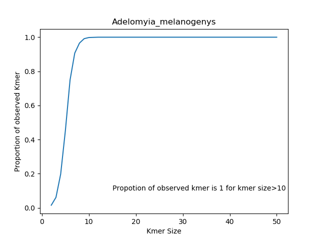

# DSP 539: Python Assignment
## Calculate Linguistic Complexity of  each sequence in a file of sequences

### _Input_: 
##### DNA Sequence (Format:Fasta)
&nbsp;
### _Output_: 
##### Linguistic Complexity of each sequence in a file of sequences
##### Generates K-mer Table
##### Generates graph from the data frame of the proportion of each kmer observed.

&nbsp;

### _Prerequisite_:
##### Python Packages: sys, pandas , os, matplotlib
##### Software: Anaconda (I used); You can choose any relevent software at your convenience
&nbsp;

### _How to run the program (Anaconda)_:
##### Go to Anaconda prompt and write  "python < FileName.py > < FileName.fasta >"
##### For example: python seq_complexity.py nd2.fasta
##### For running test go to command prompt and write "pytest" and then ENTER
&nbsp;

### _Code Description-1_:
#### File: seq_complexity.py 
##### Methods:
###### a. count_kmers(): 
         - counts total number of observed kmer of size k for each sequences
###### b. pdf(): 
         - creates panda dataframe for each sequence from kmer size 1 to length of the sequence
###### c. plot(): 
         - creates graph for each generated panda dataframe 
         - kmer size upto 50 is shown in the plot
         - For kmer size > 50 
###### d. ling_complexity()
         - Calculate liguistic complexityof a DAN sequences
###### e. file_format_check()
         - check if the input DNA sequences contain characters from {A,C,T,G,R,Y,M}
##### Output: 
###### a. linguistic complexity:
         - saved in "Linguistic Complexity" folder in ".txt" format
         - Fromat:          
|      Species      |Linguistic Complexity |
|:-----------------:|:--------------------:|
|Urosticte_benjamani|  0.992985563885059   |

###### b. Panda Dataframe:
         - saved in "Panda DataFrame" folder in ".txt" format
         - Fromat:          
|ksize|observed_kmers|possible_kmers|Observed_proportion |
|:---:|:------------:|:------------:|:------------------:|
|  1  |       4      |      4       |         1          |

###### c. Plot:
         - saved in "Plot" folder in ".png" format
         - Fromat:          

$Propotion\ of\ observed\ kmers=\begin{equation*}\frac{observed\_kmers}{possible\_kmers}\end{equation*}$

##### Notes:
###### 1. Plot is generated for each species and named according to species
###### 2. Code "R: in sequence means either "A" or "G"; Here "R" replaced by "A" arbitrarily
###### 3. Code "Y: in sequence means either "C" or "T"; Here "Y" replaced by "T" arbitrarily
###### 4. Code "M: in sequence means either "A" or "C"; Here "M" replaced by "C" arbitrarily
###### Reference: Fasta Code Meaning, <http://www.boekhoff.info/dna-fasta-codes/>
&nbsp;

### Code Description-2:
#### File: test_seq_complexity.py 
##### Methods:
###### a. test_file_is_Empty(): 
         - check if the input file is empty or not 
###### b. test_file_format_check: 
         - Check th DNA sequence contains appropriate character(A,C,T,G,R,Y,M) only
###### c. test_count_kmers(): 
         - check the sequence generate desired kmer count 
         - still development phase; might not work some cases
         - will be updated in next version

